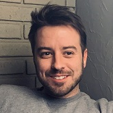

## **Gerard Lucas** - Senior Software Developer
---
[Home](README.md) | **EJ Gallo** |
[Paragon Industries](PARAGON.md) |
[Meridian Medical](MERIDIAN.md) |
[Innovative ECMO](ECMO.md)  

---

### **E&J Gallo Wineries Project** - Scheduling and Automation of Wine Creation  

#### **Project Details**

Worked on-site in Livingston and Modesto California to help with the scheduling and automated production of  
wine for one of the largest wine producers in the world. Created a custom recipe management system to allow  
user-friendly, web-based, creation of new fermentation and blending recipes.  Implemented and integrated  
a scheduling solution that monitored and updated orders based on real-time data from the factory level.  

#### **Technologies Used**

+ ASP.NET
+ AngularJS
+ MS SQL Server
+ Factory Talk View & Batch
+ Rob-Ex Scheduler

